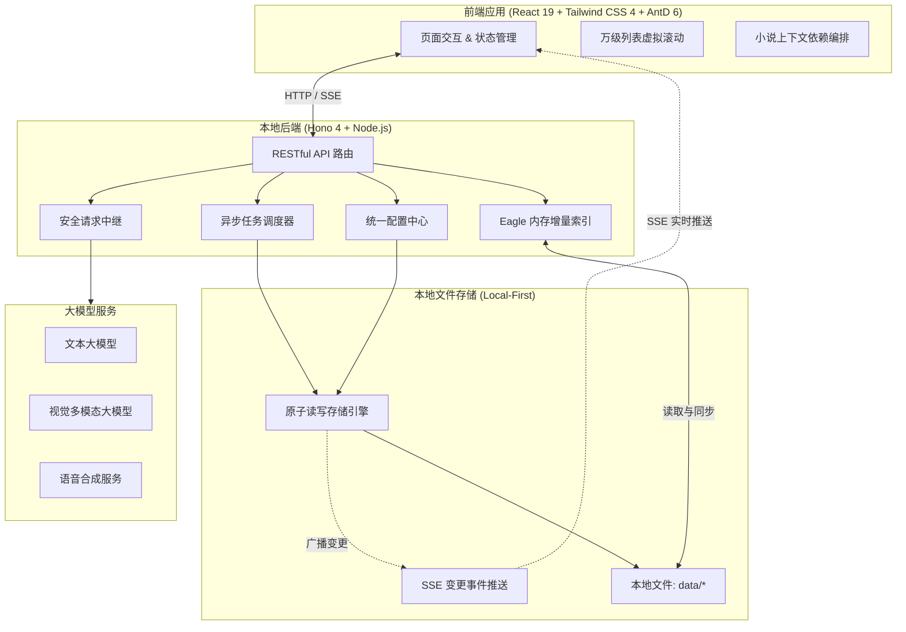

<div align="center">

# ⚡ LinAI

**开箱即用的个人 AI 创作与本地资产管理工作台**

[](https://www.typescriptlang.org/)
[](https://react.dev/)
[](https://hono.dev/)
[](https://tailwindcss.com/)
[](https://ant.design/)
[]()

[功能特性](#-功能特性) • [设计思路](#-设计思路) • [系统架构](#-系统架构) • [快速上手](#-快速上手) • [技术栈](#-技术栈)

</div>

---

## 📌 为什么做这个项目？

平时使用 AI 进行创作（生图、写文、做游戏配音、整理素材）时，工具往往非常分散：生图在一个网页，TTS 配音在另一个平台，整理素材又要手动导入到本地软件。更关键的是，许多在线平台把你的 API Key、生成的图片和写好的文本都保存在远程服务器上，不仅管理麻烦，也容易让人担心数据隐私。

**LinAI 的目标很简单：把日常高频使用的几个 AI 创作工具整合到一个纯本地运行的桌面 Web 工作台里。**

它采用前后端分离架构（React 19 + Hono），打包后内置了独立的 Node.js 绿色运行时，解压后双击即可运行。你的所有配置、API Key、图片素材、小说草稿和音频文件都直接保存在本地电脑上，安全又方便管理。

---

## 💡 设计思路

```
┌─────────────────────────────────────────────────────────────┐
│                       LinAI 架构示意图                       │
│                                                             │
│   [ 前端界面 ]      ◄── SSE 实时事件 ──►    [ 本地后端 ]      │
│   (React 19 / UI)                          (Hono 服务端)    │
│          │                                         │        │
│          ▼                                         ▼        │
│   小说依赖图 / 任务状态                     安全读写与自动备份 │
│   本地实时响应                              data/ 目录文件   │
└─────────────────────────────────────────────────────────────┘
```

1. **纯本地运行，数据完全归自己所有（Local-First）**
   所有数据、配置和 API 密钥都直接保存在本地的 `data/` 目录中，使用清晰直观的 JSON 和原生媒体文件存储。没有复杂的云端数据库依赖，随时可以用 Git 备份、网盘同步，或者自己写脚本处理。

2. **简单可靠的存储机制**
   无需额外安装数据库。后端封装了严谨的文件写入逻辑（先写入临时文件再进行原子重命名），并提供自动备份（`.bak`）与损坏隔离（`.corrupt`）机制。配合 SSE 事件推送，前端在本地数据变动时可以毫秒级自动同步最新状态。

3. **统一的配置管理与安全中继**
   各模块的 API Key 和接入点由本地后端统一管理并做类型校验。前端不需要直接拿着密钥去请求各大模型的接口，而是由本地后端在发送请求时自动注入凭据，并顺畅转发流式响应。

4. **清晰的上下文依赖管理（小说创作）**
   写长篇内容时，不把所有历史聊天记录胡乱塞给 AI，而是把设定、大纲、正文和摘要都抽象成相互关联的文段。每段内容参考了哪些设定一目了然，历史篇幅过长时自动切换为摘要，避免模型遗忘或超出长度限制。

---

## ✨ 功能特性

### 🎨 1. 图片生成与管理 (GPT-Image)
* **多接入点自由切换**：预设支持 OpenLux、DragonAPI、Venice 等接口，也可以随时添加自定义接入点与模型。
* **生图流水线与提示词辅助**：支持提示词模板库、动态优化与反推。
* **异步后台任务队列**：支持多任务并发生成与进度追踪，生成的图片会自动写入 PNG 结构化元数据，即使重启服务也能自动恢复未完成的任务。
* **实用小工具**：内置图片裁剪、画廊预览与格式转换导出。

---

### 🦅 2. Eagle 素材库联动与智能分类
与本地素材管理软件 [Eagle](https://eagle.cool/) 深度联动：
* **万级条目毫秒级加载**：采用内存增量索引，利用 `mtime.json` 指纹比对机制，上万张图片的素材库启动加载只需 100ms 左右，不卡顿。
* **三步完成智能图片整理**：
  * **01 待添加**：根据 Eagle 现有的文件夹层级自动提取分类规则，将未分类图片加入排队。
  * **02 处理中**：多并发调用视觉模型（如 Gemini Vision、Qwen VL）分析画面，自动推荐分类文件夹与描述性标题，遇到网络异常自动重试。
  * **03 待确认**：提供**普通查验模式**（多图预加载大图对照）与**极速模式**（按键盘 `D` 键一键归档、批量保存）。
* **安全同步**：直接同步更新 Eagle 目录树与条目元数据，支持移入 Eagle 回收站或彻底删除。

---

### 🎙️ 3. 多角色剧本语音合成 (TTS) `[实验性 · 开发中]`
> ⚠️ **说明**：该功能目前处于实验性阶段，部分特性仍在持续开发与迭代中。

适合制作有声书、短视频配音或独立游戏对话：
* **角色音色绑定**：集成 Inworld 与 Gemini TTS，支持在一个工程里为不同角色配置专属音色。
* **剧本切分与合成**：自动将文本切分为旁白与对话，可视化调整语速、停顿与情感。
* **Ren'Py 游戏工程联动**：生成的音频与对应台词可以直接同步输出到 Ren'Py 游戏工程的对应目录中。

---

### 📖 4. 结构化长篇小说创作 (Novel) `[实验性 · 开发中]`
> ⚠️ **说明**：该功能目前处于实验性阶段，部分特性仍在持续开发与迭代中。

* **模块化文段管理**：将参考资料、人物/世界观设定、分卷大纲、章节正文与章节摘要统一管理。
* **依赖关系追踪**：清楚记录每一段文字是依据哪些设定生成出来的，支持历史版本随时无损回溯。
* **自适应滑动窗口**：当故事写长之后，早期章节自动转换为摘要参与后续生成，既保留了长线伏笔，又不会爆 Token。
* **细粒度生成指令**：支持生成大纲、局部精修重写、正文润色与连续推演续写。

---

### ☁️ 5. API 聚合与额度监控
* 集中管理第三方 API 聚合渠道的 Token。
* 实时查询账户余额与使用情况，避免余额耗尽影响使用。

---

## 🛠️ 系统架构



---

## 📦 快速上手

### 方式 1：免安装绿色版（普通用户推荐）
1. 下载最新的 `LinAI-vX.X.X.zip` 压缩包并解压到任意文件夹。
2. 双击运行目录下的 **`双击运行.bat`**。
3. 程序会自动启动本地后台服务，并在你的默认浏览器中打开工作台页面。

---

### 方式 2：从源码运行（开发者）

#### 1. 前置环境
* **Node.js**: `>= 20.0.0`
* **包管理器**: `pnpm`

#### 2. 安装与启动
```bash
# 克隆仓库
git clone https://github.com/your-username/LinAI.git
cd LinAI

# 安装依赖
pnpm install

# 启动开发服务器（前端 + 后端热重载）
pnpm dev
```

> 启动后：
> * 前端页面：`http://localhost:5174`
> * 后端接口：`http://localhost:3001`（前端已自动配置代理）

#### 3. 常用开发命令
```bash
# 类型检查（修改代码后运行）
npx tsc --noEmit

# 代码格式化
pnpm prettier
```

---

## 🧰 技术栈

| 层次 | 技术选型 | 说明 |
| :--- | :--- | :--- |
| **前端框架** | React 19 + TypeScript | 使用 React 19 配合 TypeScript 进行组件开发 |
| **构建工具** | Vite 8 | 极速冷启动与热更新 |
| **UI 组件库** | Ant Design 6 (zhCN) | 企业级组件库，搭配深浅主题切换与自定义强调色 |
| **样式方案** | Tailwind CSS 4 + Sass | 原子化 CSS 与主题样式映射 |
| **前端状态** | Zustand 5 + ahooks | 轻量、清晰的全局与模块状态管理 |
| **大数据量渲染** | @tanstack/react-virtual | 虚拟滚动，保证数万张图片列表流畅滑动 |
| **服务端框架** | Hono 4 + @hono/node-server | 轻量高效的 Node 服务端框架，前后端共享类型推导 |
| **数据校验** | Zod 4 + @hono/zod-validator | 接口入参校验与配置 Schema 定义 |
| **多媒体处理** | Sharp 0.34 + wav | 本地高性能图像压缩裁剪与音频处理 |
| **打包分发** | tsup + JSZip + 便携 Node 运行时 | 打包生成单目录免安装的 Windows 绿色压缩包 |

---

## ⚠️ 注意事项

1. **本地配置与密钥安全**：`data/` 目录中的 `config.json` 包含你填写的 API Key，该目录已被 `.gitignore` 忽略，请不要将含有真实 Key 的数据文件提交到公共代码仓库。
2. **Eagle 库读写安全**：对 Eagle 素材库的修改全部通过专用的安全写入层进行，不会破坏 Eagle 自身的库结构。
3. **提交规范**：Git 提交时请确保 `user.name` 不包含中文真实姓名。

---

<div align="center">

**LinAI · 打造顺手、可靠的本地 AI 创作工作台**

</div>
