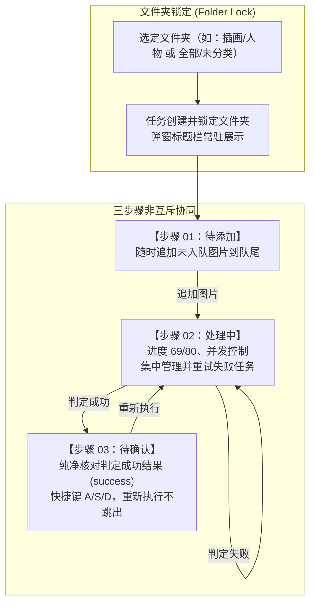

# Eagle 图片整理流程优化实现方案

> **参考文档**：`src/client/pages/module/Eagle/README.md`  
> **涉及模块**：`src/client/pages/module/Eagle/Organize/` 及服务端 `src/server/module/eagle/organize/`  
> **文档定位**：本方案详细规划了从「互斥三步流」升级为「基于锁定文件夹的非互斥多步骤协同流」的技术架构、数据结构、接口设计与前端 UI 交互实现。

---

## 1. 现状痛点与重构目标

### 1.1 现状痛点分析

当前 Eagle 图片整理功能采用严格基于单一 `phase`（`running` / `paused` / `confirming` / `done`）的单向硬编码步骤路由，存在以下主要痛点：

1. **步骤完全互斥，无法灵活追加**：
   - 任务一旦创建进入步骤 2（`running`），用户无法切回步骤 1 查看已选分类标准或追加同文件夹下其余未处理图片；必须等待所有图片跑完且全部在步骤 3 确认完毕（进入 `done`）或强制清空后，才能再次开启整理。
2. **单图重新执行打断确认流**：
   - 在步骤 3（`StepConfirm`）确认过程中，若用户对单张图片点击「重新执行」，服务端将任务 `phase` 拉回 `running`，导致前端弹窗被强制切回步骤 2（`StepRunning`），打断了用户连续确认其余正常结果的沉浸体验。
3. **错误处理与正常结果混杂**：
   - 步骤 3 同时拉取了判定成功（`success`）与判定失败（`failed`）的条目。用户在确认界面中既要核对正确分类，又要面对报错信息且无法确认目标文件夹，流程割裂。
4. **缺乏全局步骤总览与自由切换**：
   - 缺乏步骤导航与状态总览，用户无法随时掌握「待添加 / 处理中 / 待确认」的各阶段数字与状态。
5. **文件夹归属未显式锁定与展示**：
   - 任务运行时未在弹窗标题明确标注当前处理的文件夹，若用户在背景主界面切换文件夹容易产生认知混淆。

---

### 1.2 优化目标与核心设计原则



1. **锁定文件夹（Folder Lock）**：
   - 整理任务创建时，即绑定并锁定当前选定的文件夹（记录 `folderId` 与 `folderName`）。
   - 只要任务存在未完成图片（包括排队中、处理中、失败待重试或待确认），文件夹持续锁定。
   - 模态框标题栏明确展示锁定的文件夹名称；锁定期间禁止切换至其他文件夹开启新分类；如需更换文件夹，必须清空任务或全部处理完毕。
2. **三步骤非互斥与自由切换**：
   - **步骤 1（待添加）**：只要处于当前锁定文件夹，无论后台在执行还是在确认，用户可随时进入步骤 1 将剩余未入队的图片追加到队列末尾。
   - **步骤 2（处理中）**：展示后台实时进度（如 `69/80`）、并发控制与暂停/继续；**失败的任务集中在步骤 2 展示与重试**，失败不计入成功计数，不阻塞后续正常流程。
   - **步骤 3（待确认）**：**只处理判定成功的结果（`status === 'success'`）**。单图重新执行仅将该图状态置回重试并送回步骤 2 队列，步骤 3 界面继续保留在当前视图确认下一张，不跳出。
3. **左侧卡片导航与总览**：
   - 模态框左侧新增竖排 3 个小卡片按钮（`01 待添加`、`02 处理中`、`03 待确认`），集成各步骤实时数量与状态徽标，支持自由点击切换。

---

## 2. 目标数据结构与前后端协议

### 2.1 共享类型扩展 (`src/shared/eagle/organize.ts`)

```ts
// 1. 任务视图与持久化记录增加锁定文件夹字段
export interface OrganizeTaskRecord {
  phase: 'running' | 'paused' | 'confirming' | 'done'
  pausedReason: 'user' | 'error' | 'restart' | null
  compress: boolean
  concurrency: number
  createdAt: number
  standards: OrganizeFolderStandard[]
  itemIds: string[]
  /** 锁定的文件夹 ID（空字符串或 undefined 表示「全部」） */
  folderId?: string
  /** 锁定的文件夹展示名称/路径（如 "插画/人物"、"全部"、"未分类"） */
  folderName: string
  executed: number
  pendingConfirm: number
  successCount: number
  failedCount: number
}

export interface OrganizeTaskView extends OrganizeTaskRecord {
  total: number
  /** 当前锁定文件夹下剩余未入队的可处理图片数 */
  availableCount?: number
}

// 2. 徽标与弹窗轻量状态扩展
export interface OrganizeStatus {
  phase: OrganizePhase
  /** 剩余未执行数量 (total - executed) */
  remaining: number
  /** 步骤 3 待确认数量 (仅 success 且未处理) */
  pendingConfirm: number
  /** 步骤 2 失败待重试/待处理数量 */
  failedCount: number
  pausedReason: 'user' | 'error' | 'restart' | null
  /** 锁定的文件夹信息 */
  folderId?: string
  folderName?: string
  /** 是否存在活跃锁定任务 */
  isLocked: boolean
}

// 3. 步骤 1 准备数据扩展（支持追加模式计算）
export interface OrganizePrepareResp {
  standards: OrganizeFolderStandard[]
  /** 当前文件夹总可处理图片数 */
  imageCount: number
  /** 当前已入队图片数 */
  enqueuedCount: number
  /** 剩余可追加图片数 (imageCount - enqueuedCount) */
  availableCount: number
  /** 当前锁定的文件夹 ID 与名称（若已锁定） */
  lockedFolderId?: string
  lockedFolderName?: string
}

// 4. 追加图片请求体
export interface OrganizeAppendTaskParams {
  count: number
}
```

---

### 2.2 API 接口清单 (`/api/eagle/organize/*`)

| 方法   | 路径                                             | 说明                                                   | 变更类型                                |
| :----- | :----------------------------------------------- | :----------------------------------------------------- | :-------------------------------------- |
| `GET`  | `/organize/prepare?folderId&sortBy&sortOrder`    | 获取分类标准与当前文件夹可处理数/已入队数/剩余可追加数 | **修改**（增加已入队和可用数统计）      |
| `GET`  | `/organize/status`                               | 获取轻量状态，包含锁定文件夹与各阶段数量               | **修改**（增加锁定信息与失败数）        |
| `GET`  | `/organize/task`                                 | 获取任务详情视图与锁定信息                             | **修改**                                |
| `POST` | `/organize/task`                                 | 创建新整理任务（初次锁定文件夹）                       | **修改**（记录 folderId 与 folderName） |
| `POST` | `/organize/task/append`                          | 向当前锁定文件夹的任务追加图片到队尾                   | **新增**                                |
| `POST` | `/organize/task/pause` / `/resume`               | 暂停 / 继续队列派发                                    | 维持                                    |
| `POST` | `/organize/task/retry-failed`                    | 批量重试所有失败项（移至队首重新执行）                 | 维持                                    |
| `POST` | `/organize/task/clear`                           | 强制清空任务与结果，解锁文件夹                         | 维持                                    |
| `GET`  | `/organize/queue?limit=20`                       | 队列排队中/执行中条目预览                              | 维持                                    |
| `GET`  | `/organize/failed-items`                         | 步骤 2 专用：获取所有判定失败条目列表                  | **新增**（方便步骤 2 集中处理）         |
| `GET`  | `/organize/results?status=success`               | 步骤 3 专用：获取判定成功的结果列表                    | **修改**（步骤 3 仅请求 success）       |
| `POST` | `/organize/results/:itemId/confirm`              | 确认单张图片分类（写库）                               | 维持                                    |
| `POST` | `/organize/results/:itemId/skip`                 | 不处理单张图片                                         | 维持                                    |
| `POST` | `/organize/results/:itemId/retry`                | 重新执行单张图片（重置为 pending 入队，不打断步骤 3）  | **修改**（解除强行切步骤 2）            |
| `POST` | `/organize/results/:itemId/clear-classification` | 清除分类移入未分类                                     | 维持                                    |

---

## 3. 前端 UI 架构与交互设计

### 3.1 弹窗主布局重构 (`OrganizeModal`)

模态框采用「左侧导航卡片栏 + 右侧主操作区」的经典分栏架构，宽度调整为 `880px`，高度适中居中展示。

```
+-----------------------------------------------------------------------------------------------+
| 图片整理 - 锁定文件夹：插画/二次元人物                                                [X]     |
+-------------------+---------------------------------------------------------------------------+
| [01 待添加]       |                                                                           |
| 剩余 45 张可选    |                                                                           |
| ----------------- |                                                                           |
| [02 处理中]       |                       右侧主工作面板                                      |
| 进度 69/80 (执行中)|   (根据左侧选中的卡片渲染 StepClassify / StepRunning / StepConfirm)        |
| 3 失败            |                                                                           |
| ----------------- |                                                                           |
| [03 待确认]       |                                                                           |
| 15 张待确认       |                                                                           |
+-------------------+---------------------------------------------------------------------------+
```

#### 模态框标题栏设计

- **未锁定（无任务/已完成）**：展示 `图片整理`。
- **已锁定（任务活跃中）**：展示 `图片整理 - 锁定文件夹：[文件夹名称]`。
  - 根目录展示为：`图片整理 - 锁定文件夹：全部`。
  - 未分类展示为：`图片整理 - 锁定文件夹：未分类`。
  - 子文件夹展示完整路径：如 `图片整理 - 锁定文件夹：作品/原画/角色`。
  - 附带 Tooltip 说明：“当前任务处理完成或清空前，不可切换其他文件夹分类”。

#### 左侧导航卡片 (`StepNavBar`)

1. **01 待添加 卡片**：
   - 标题：`01 待添加`
   - 副标题/状态：
     - 无任务时显示：`新建分类任务`
     - 任务进行中且有剩余时显示：`剩余 X 张可选`
     - 任务进行中已选满时显示：`全部图片已入队`
   - 点击行为：切换至步骤 1（新建或追加界面）。
2. **02 处理中 卡片**：
   - 标题：`02 处理中`
   - 副标题/状态：
     - 进度：`69/80`（成功数/总数 或 已执行/总数）
     - 执行状态指示：`执行中`（绿色脉冲呼吸灯）、`已暂停`（橙色标签）、`3 项失败`（红色小徽标）
   - 初始无任务或未添加图片时置灰（`disabled`）。
   - 点击行为：切换至步骤 2（监控进度、控制并发、集中处理失败项）。
3. **03 待确认 卡片**：
   - 标题：`03 待确认`
   - 副标题/状态：
     - `X 张待确认`（展示成功待确认的数字）
     - 右上角徽标：橙色/红色数量 Badge。
     - 若待确认数为 0 且处理中，显示 `0 张待确认`。
   - 初始无任何成功判定结果时置灰（`disabled`）。
   - 点击行为：切换至步骤 3（核对建议分类与标题）。

#### 智能默认激活步骤策略

- 模态框打开时自动定位到最适合的步骤：
  1. 若有待确认结果（`pendingConfirm > 0`），默认定位到 `03 待确认`；
  2. 若无待确认结果，但任务处于 `running` 或 `paused`，默认定位到 `02 处理中`；
  3. 若无任务或任务已 `done`，默认定位到 `01 待添加`。
- 用户在打开后可任意点击卡片自由切换，不再受 `phase` 强制约束。

---

### 3.2 步骤 1：待添加 (`StepClassify.tsx`)

步骤 1 支持「新建任务」与「追加图片」双模式智能切换：


1. **新建任务模式**：
   - 展示分类标准（有描述的文件夹按优先级排列）。
   - 选择本次处理数量、并发数（1~10）、是否压缩图片。
   - 点击「确定」创建新任务，锁定当前选中的文件夹，并自动跳转至 `02 处理中`。
2. **追加图片模式**：
   - 顶部提示条：“当前任务已锁定文件夹：**[文件夹名称]**，已有 **X** 张在队列中”。
   - 核心展示：`剩余 Y 张未入队可处理图片`。
   - 追加设置：
     - 追加数量输入框（`InputNumber`，上限为剩余可用数 `availableCount`）。
     - 提示：“追加的图片将按原有分类标准与并发配置，排在当前队列末尾继续执行”。
   - 底部按钮：
     - 若 `availableCount > 0`：提供「追加到队列」主按钮，点击后调用追加接口，保留在步骤 1 或弹出快捷跳转提示。
     - 若 `availableCount === 0`：展示「当前文件夹图片已全部加入队列」的空状态提示。

---

### 3.3 步骤 2：处理中与错误集中处理 (`StepRunning.tsx`)

步骤 2 承担「进度监控」与「所有错误处理」两大职责，确保错误不外溢到步骤 3：

```
+-----------------------------------------------------------------------------------------------+
| [执行中 (并发 5)]    [已执行 69/80]    [成功 66]    [失败 3]    [待确认 66 张]                 |
+-----------------------------------------------------------------------------------------------+
| 【失败待处理 (3)】 | 排队与执行中 (11)                                                       |
| +-------------------------------------------------------------------------------------------+ |
| | [图] item_001.png   [网络超时: Vision API 请求失败]             [重试]   [跳过]            | |
| | [图] item_002.png   [格式错误: 模型返回非法 JSON]               [重试]   [跳过]            | |
| | [图] item_003.png   [参数错误: 超出 token 上限]                 [重试]   [跳过]            | |
| +-------------------------------------------------------------------------------------------+ |
| 批量操作：[重试所有错误]  [全部跳过]                                                          |
+-----------------------------------------------------------------------------------------------+
| 提示：已有 66 张判定成功，可随时点击左侧「03 待确认」先行查验结果。                             |
|                                                     [清空任务]      [暂停/继续]              |
+-----------------------------------------------------------------------------------------------+
```

1. **进度与执行状态看板**：
   - 顶部五联状态块：执行状态（执行中/已暂停）、已执行进度（`69/80`）、判定成功数、判定失败数、待确认张数。
   - 进度计数公式：`已执行数 / 总入队数`，失败项明确标识，不计入成功。
2. **错误处理专区（核心改进）**：
   - Tab 1：**失败待处理列表**（仅有失败项时高亮或默认展示）：
     - 显示失败图片的缩略图、文件名、红色失败原因详情。
     - 操作支持：
       - 单项「重试」：重置该图片为 `pending` 并移至执行队列队首或队尾，执行器立即唤醒执行。
       - 单项「跳过/不处理」：将该项置为 `skipped`，移出失败列表。
       - 顶部「重试所有错误」：一键将所有失败图片重置为 `pending` 并恢复执行。
       - 顶部「全部跳过」：将所有失败图片标记为 `skipped`。
   - Tab 2：**排队中与执行中队列预览**：
     - 展示正在请求中的项（带 loading 状态）和排队中的前 20 条。
3. **底部控制栏**：
   - 左侧：常驻引导文本“已有 X 张判定成功，可随时点击左侧「03 待确认」先行查验结果”。
   - 右侧：【清空任务】（二次确认红色按钮）、【暂停/继续】按钮。

---

### 3.4 步骤 3：待确认结果查验 (`StepConfirm.tsx`)

步骤 3 专注于高效核对成功结果，完全剔除失败项的干扰：

1. **纯净的成功结果流**：
   - 仅加载 `status === 'success'` 的结果，不再混合 `failed` 条目。
   - 顶部缩略图栏只展示成功待确认的图片。
2. **快捷查验与操作**：
   - 快捷键支持：`A` 清除分类手动处理，`S` 不处理/跳过，`D` 确认分类。
   - 候选目标文件夹单选（推荐度排序）、建议标题勾选框、原文件夹与原标题对比、疑似低质标签。
3. **「重新执行」平滑体验**：
   - 用户在步骤 3 对某张图片点击「重新执行」时：
     - 接口将该图片重置为 `pending`，加入步骤 2 的执行队列。
     - 步骤 3 本地列表立即移出该图片，并自动聚焦到下一张待确认图片。
     - **弹窗不强制切回步骤 2**，步骤 3 用户继续流畅确认后续图片；左侧 `02 处理中` 卡片徽标实时显示任务恢复执行。
4. **完成与过渡状态**：
   - 当步骤 3 本地待确认列表处理完毕，而步骤 2 仍有图片在执行时：展示友好占位“当前批次已全部确认，后台仍在继续处理剩余图片，可切换至「02 处理中」查看进度”。
   - 当步骤 2 队列全部执行完毕且步骤 3 全部确认完成时：展示「全部图片整理完成！」成功状态，并自动解除文件夹锁定。

---

## 4. 服务端核心逻辑改造实现

### 4.1 任务仓储与数据管理 (`src/server/module/eagle/organize/`)

#### 1. 任务创建与文件夹锁定 (`service.ts`)

```ts
async createTask(params: OrganizeCreateTaskParams): Promise<CreateTaskResult> {
  await this.ready
  const existing = await organizeRepository.getTask()
  if (existing && existing.phase !== 'done') {
    return { ok: false, status: 409, error: '当前仍有未完成的整理任务，请先处理或清空' }
  }

  // 解析文件夹名称
  const folderName = await this.resolveFolderName(params.folderId)
  const standards = await getFolderStandards()
  const { total, itemIds } = await getClassifiableItems(params)

  const record: OrganizeTaskRecord = {
    phase: 'running',
    pausedReason: null,
    compress: params.compress,
    concurrency: params.concurrency,
    createdAt: Date.now(),
    standards,
    folderId: params.folderId,
    folderName,
    itemIds: itemIds.slice(0, Math.min(params.count, total)),
    executed: 0,
    pendingConfirm: 0,
    successCount: 0,
    failedCount: 0,
  }

  await organizeRepository.clearItems()
  await organizeRepository.saveTask(record)
  this.publishChange()
  organizeExecutor.kick()
  return { ok: true, task: toTaskView(record) }
}
```

#### 2. 追加图片到现有队列 (`service.ts`)

```ts
async appendItems(count: number): Promise<OrganizeActionResult> {
  await this.ready
  const task = await organizeRepository.getTask()
  if (!task || task.phase === 'done') {
    return { ok: false, status: 409, error: '当前没有正在进行的任务可追加图片' }
  }

  // 按照原任务锁定的 folderId 重新获取可分类图片
  const { itemIds: allAvailable } = await getClassifiableItems({
    folderId: task.folderId,
    sortBy: 'mtime', // 或任务创建时的偏好
    sortOrder: 'desc',
  })

  // 过滤掉已经在任务队列中的 itemIds
  const existingSet = new Set(task.itemIds)
  const toAppend = allAvailable.filter(id => !existingSet.has(id)).slice(0, count)

  if (toAppend.length === 0) {
    return { ok: false, status: 400, error: '没有更多可追加的图片' }
  }

  await organizeRepository.mutateTask(latest => {
    if (!latest || latest.phase === 'done') return null
    return {
      ...latest,
      itemIds: [...latest.itemIds, ...toAppend],
      // 若此前已是 confirming，追加后拉回 running 继续处理
      phase: latest.phase === 'confirming' ? 'running' : latest.phase,
    }
  })

  this.publishChange()
  // 唤醒执行器继续派发
  organizeExecutor.kick()
  return { ok: true }
}
```

#### 3. 执行器动态派发适配 (`executor.ts`)

- 执行器内部使用 `cursor` 游标按序派发。
- 当 `itemIds` 动态被追加增大后，执行器的 `lanes` 循环会自动感知 `itemIds.length` 的增长并继续向下处理。
- 若执行器在此前已处理完旧队列而休眠，`appendItems` 调用的 `kick()` 会重新启动派发流程，无需额外重建状态。

---

## 5. 实施计划与步骤分解

| 阶段                                    | 核心任务                                                                                                                                                                                    | 涉及主要文件                                                                                                                                                                        | 预计成果                                    |
| :-------------------------------------- | :------------------------------------------------------------------------------------------------------------------------------------------------------------------------------------------ | :---------------------------------------------------------------------------------------------------------------------------------------------------------------------------------- | :------------------------------------------ |
| **阶段一**<br/>数据模型与服务接口扩展   | 1. 扩展 `src/shared/eagle/organize.ts` 类型定义<br/>2. 服务端 `storage.ts` 支持锁定字段持久化<br/>3. `service.ts` 实现追加图片、失败项查询、剩余可追加计算<br/>4. `api/eagle.ts` 注册新路由 | `src/shared/eagle/organize.ts`<br/>`src/server/module/eagle/organize/storage.ts`<br/>`src/server/module/eagle/organize/service.ts`<br/>`src/server/api/eagle.ts`                    | 后端具备文件夹锁定、追加图片及错误隔离能力  |
| **阶段二**<br/>前端 Store 与 API 封装   | 1. `Organize/api.ts` 封装追加图片与失败项管理接口<br/>2. `Organize/store.ts` 适配锁定状态与多阶段数量推送                                                                                   | `src/client/pages/module/Eagle/Organize/api.ts`<br/>`src/client/pages/module/Eagle/Organize/store.ts`                                                                               | 前端状态层支持锁定展示与多步骤数据订阅      |
| **阶段三**<br/>导航卡片与模态框布局重构 | 1. 新建 `StepNavBar.tsx` 左侧卡片导航组件<br/>2. 重构 `Organize/index.tsx` 布局与标题栏锁定展示<br/>3. 实现智能默认步骤与非互斥自由切换                                                     | `src/client/pages/module/Eagle/Organize/StepNavBar.tsx`<br/>`src/client/pages/module/Eagle/Organize/index.tsx`                                                                      | 模态框呈现左导航+右内容，支持多步骤自由跳转 |
| **阶段四**<br/>三步骤组件功能改造       | 1. `StepClassify.tsx` 支持新建/追加双模式<br/>2. `StepRunning.tsx` 实现失败项集中管理与进度展示（`69/80`）<br/>3. `StepConfirm.tsx` 仅拉取 success 结果，重新执行不跳出                     | `src/client/pages/module/Eagle/Organize/StepClassify.tsx`<br/>`src/client/pages/module/Eagle/Organize/StepRunning.tsx`<br/>`src/client/pages/module/Eagle/Organize/StepConfirm.tsx` | 完成所有功能闭环与交互体验提升              |
| **阶段五**<br/>文档与类型验证           | 1. 更新 `src/client/pages/module/Eagle/README.md`<br/>2. 运行 `npx tsc --noEmit` 进行全量类型检查                                                                                           | `src/client/pages/module/Eagle/README.md`                                                                                                                                           | 确保全栈类型安全，文档同步更新              |

---

## 6. 验证与测试要点

1. **文件夹锁定验证**：
   - 选定某个子文件夹开启整理，验证模态框标题栏是否正确显示 `图片整理 - 锁定文件夹：[子文件夹路径]`。
   - 在任务执行中与待确认阶段，验证主界面切换文件夹时，整理弹窗是否保持原有锁定文件夹不变。
2. **步骤 1 随时追加验证**：
   - 任务在步骤 2 执行或步骤 3 确认时，点击 `01 待添加`，验证是否正确展示剩余可追加图片数。
   - 输入追加数量并提交，验证队列总数是否增加，执行器是否无缝继续处理新追加的图片。
3. **步骤 2 错误集中管理验证**：
   - 模拟 API 报错产生失败图片，验证失败图片是否仅出现在步骤 2 的「失败待处理」列表中，不流入步骤 3。
   - 验证步骤 2 进度显示格式为 `已执行/总数`，单项重试与「重试所有错误」能正常将失败项重置为 pending 并重新执行。
4. **步骤 3 纯净确认与重新执行验证**：
   - 验证步骤 3 仅包含判定成功的图片，快捷键 A/S/D 正常运作。
   - 对单张图片点击「重新执行」，验证该图片是否移出待确认列表，弹窗是否停留在步骤 3 自动选中下一张，同时步骤 2 队列增加该重试任务。
5. **任务完成与解锁验证**：
   - 当所有图片均确认或跳过，队列为空时，验证任务状态转为 `done`，文件夹锁定解除，步骤卡片恢复初始新建状态。
